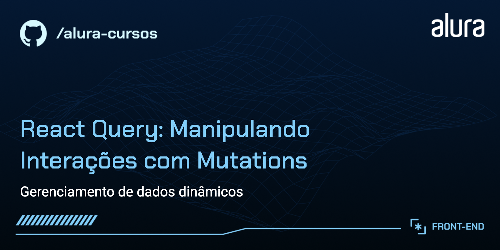

# Título do Curso: React Query: Manipulando Interações com Mutations

Curso prático de React Query, uma ferramenta poderosa para gerenciar o estado de operações HTTP em aplicações React. Com um foco específico nas mutations e no uso do hook useMutation, este curso guiará você através de conceitos fundamentais até a implementação prática de mutações e Optimistic Update (atualização otimista). Aprenda a otimizar a interatividade da aplicação ao inserir funcionalidades como thumbsUp, comentários e respostas de comentários. Ideal para desenvolvedores que desejam melhorar a performance e a simplicidade de suas aplicações ao lidar com operações assíncronas.

## 🔨 Funcionalidades do Projeto

O curso abrange a integração do Back-end com o Front-end de um blog dinâmico:

- Listagem de posts com paginação.
- Exibição detalhada de cada post.
- Inserção de thumbsUp, comentários e respostas de comentários.
- Integração com APIs usando fetch através do React-query.

## ✔️ Técnicas e Tecnologias Utilizadas

As principais técnicas e tecnologias abordadas são:

- `Introdução a mutation`: compreensão como o React Query simplifica a inserção de dados dinâmicos através de API's de integração.
- `Implementação com useMutation`: utilização do hook `useMutation` para realizar a integração de APIs, gerenciando inserção e carregamento de dados, erros e cache.
- `Técnicas avançadas`: melhores práticas e técnicas avançadas como o Optimistic Update (atualização otimista) via UI e cache.
- `Fetch API`: realizar requisições HTTP para buscar dados.

## 🎯 Desafios do Curso

Implementação de funcionalidades avançadas, como:

- Consumo de uma API de posts usando React-query.
- Optimistic Update via UI e cache.
- Invalidação e rollback de cache.

## 🛠️ Abrir e Rodar o Projeto

Após baixar o projeto, você pode abrir com seu editor de código preferido. Siga estes passos:

- Abra o terminal no diretório do projeto.
- Na raiz do projeto execute `docker compose up`.
- Execute `yarn` para instalar as dependências.
- Execute `yarn build` para contruir a aplicação.
- Inicie o servidor de desenvolvimento com `yarn dev`.
- Acesse `http://localhost:3000` no navegador para ver o projeto.
